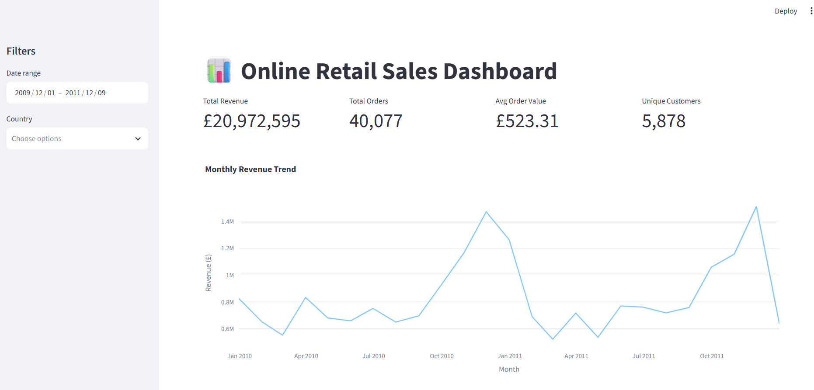

# 📊 Online Retail Sales Dashboard

> An interactive Streamlit dashboard turning ~1.07M raw UK retail transactions into executive-level revenue KPIs, seasonal trends, and evidence-based business recommendations.

**Live Demo:** [link — update once deployed to Streamlit Community Cloud] &nbsp;·&nbsp; **Screenshot below**



---

## Table of Contents

1. [Project Overview](#1-project-overview)
2. [Objectives](#2-objectives)
3. [Project Scope & Tools](#3-project-scope--tools)
4. [Repository Structure](#4-repository-structure)
5. [Data Workflow](#5-data-workflow)
6. [Data Model & Schema](#6-data-model--schema)
7. [Analysis & Metrics](#7-analysis--metrics)
8. [Key Insights](#8-key-insights)
9. [Recommendations](#9-recommendations)
10. [Assumptions & Limitations](#10-assumptions--limitations)
11. [Future Enhancements](#11-future-enhancements)
12. [Deliverables](#12-deliverables)
13. [Author](#13-author)

---

## 1. Project Overview

**Context:** E-commerce and wholesale retailers generate large volumes of raw transaction data that's too noisy and unstructured for a decision-maker to read directly — it takes real cleaning and aggregation before it says anything useful about the business.

**Problem Statement:** This project turns ~1.07M raw transaction records from a UK-based online gift-ware retailer into trustworthy, decision-ready KPIs — while explicitly separating genuine sales from cancellations, inventory write-offs, and non-product charges like postage, so the numbers reflect real business performance rather than raw export noise.

**Approach:** Using Python and Pandas, the raw dataset was cleaned through evidence-verified rules (each rule checked against the data before being applied, not assumed), then aggregated into KPIs and visualized with Plotly inside an interactive Streamlit dashboard with live date-range and country filters.

**Outcome:** A deployed, filterable dashboard reporting Total Revenue (£20,972,594.57), Orders, Average Order Value, top products and markets, and auto-generated plain-language business insights — plus a documented set of evidence-based recommendations (see [§9](#9-recommendations)).

---

## 2. Objectives

- **Primary Objective:** Build a reproducible pipeline that cleans ~1.07M raw transaction records into trustworthy, auditable revenue KPIs.
- **Secondary Objective 1:** Identify the top-performing products and markets by revenue.
- **Secondary Objective 2:** Quantify seasonal revenue patterns to inform inventory and marketing planning.
- **Secondary Objective 3:** Package the analysis into an interactive, filterable Streamlit dashboard usable by a non-technical stakeholder.

> 💡 _Every analysis decision in this project traces back to one of these objectives._

---

## 3. Project Scope & Tools

### Scope

| Dimension        | Details                                                                                                                                                                                                                |
| ---------------- | ---------------------------------------------------------------------------------------------------------------------------------------------------------------------------------------------------------------------- |
| **In Scope**     | Full Online Retail II dataset (Dec 2009–Dec 2011), transaction-line granularity; revenue, order, product, and country-level analysis.                                                                                  |
| **Out of Scope** | Customer demographic segmentation (not present in source data); marketing spend / attribution (no such data exists for this dataset); predictive forecasting (this project is descriptive/diagnostic, not predictive). |
| **Time Period**  | December 1, 2009 – December 9, 2011.                                                                                                                                                                                   |
| **Granularity**  | Transaction-line level — one row per product line within an invoice.                                                                                                                                                   |

### Tools & Technologies

| Category               | Tool(s) Used                                                       |
| ---------------------- | ------------------------------------------------------------------ |
| Data Storage           | Raw `.xlsx` file (Online Retail II), loaded directly — no database |
| Data Processing        | Python, Pandas                                                     |
| Analysis               | Pandas (`groupby`, `agg`, `resample`, `pct_change`)                |
| Visualization          | Plotly Express                                                     |
| Dashboard / Deployment | Streamlit, Streamlit Community Cloud                               |
| Version Control        | Git / GitHub (GitHub Desktop)                                      |
| Documentation          | Markdown                                                           |

---

## 4. Repository Structure

```
Python-Online-Sales-Dashboard/
│
├── data/                      # Raw dataset (online_retail_II.xlsx) — see Setup if not included
├── docs/                      # PROJECT_NOTES.md — methodology, cleaning rationale, caveats
├── notebooks/                 # Python_online_sales_dashboard.ipynb — full analysis notebook
├── scripts/                   # sales_dashboard_final.py — the Streamlit dashboard app
├── reports/                   # (unused — no PDF/slide deliverables for this project)
├── queries/                   # (unused — this is a Python/Pandas project, not SQL)
├── visuals/                   # Dashboard screenshots for this README
├── .gitignore
├── HOW_TO_USE.md
├── project_metadata.yml
└── README.md                  # You are here
```

> `reports/` and `queries/` are template folders retained for consistency but not used in this project — everything here is Python/Pandas-driven with no SQL layer or slide-deck deliverable.

---

## 5. Data Workflow

```
[Online Retail II .xlsx, two sheets]
      ↓
[pandas.read_excel — both sheets loaded and concatenated]
      ↓
[Evidence-verified cleaning: cancellations, write-offs, invalid price/quantity]
      ↓
[Feature engineering (Revenue) + aggregation (monthly, product, country)]
      ↓
[Streamlit dashboard: filtered KPIs, charts, auto-generated insights]
```

1. **Source:** Online Retail II dataset (UCI Machine Learning Repository), distributed as a two-sheet `.xlsx` file (2009–2010 and 2010–2011), ~1.07M rows combined.
2. **Ingestion:** Both sheets loaded via `pandas.read_excel()` and concatenated into a single DataFrame.
3. **Cleaning:** Excluded cancelled invoices (`Invoice` starting with `'C'`), rows with missing `Description` (confirmed to overlap 100% with `Price == 0`, indicating write-offs), non-positive `Price`, and non-positive `Quantity`. 25,701 rows (2.4% of raw data) removed — each rule checked against the data before being applied.
4. **Transformation:** Engineered `Revenue = Quantity × Price` at the transaction-line level; excluded non-merchandise `StockCode`s (postage, fees, adjustments) specifically from product-ranking calculations only.
5. **Analysis:** Monthly resampling and month-over-month growth, `groupby` aggregation for top products/countries, KPI calculation (Total Revenue, Orders, AOV, Unique Customers).
6. **Output:** Interactive Streamlit dashboard (KPI cards, line/bar/donut charts, auto-generated insight text) plus this documentation and a set of business recommendations.

---

## 6. Data Model & Schema

This is a single flat dataset — no joins or multi-table schema.

### Dataset: `online_retail_II`

| Field Name    | Data Type        | Description                                        | Example Value                          |
| ------------- | ---------------- | -------------------------------------------------- | -------------------------------------- |
| `Invoice`     | string           | Transaction/basket ID; prefixed `'C'` if cancelled | `"489434"` / `"C536379"`               |
| `StockCode`   | string           | Product or operational code (postage, fees, etc.)  | `"85123A"`                             |
| `Description` | string           | Product name                                       | `"WHITE HANGING HEART T-LIGHT HOLDER"` |
| `Quantity`    | int              | Units sold on this line                            | `12`                                   |
| `InvoiceDate` | datetime         | Transaction timestamp                              | `2009-12-01 07:45:00`                  |
| `Price`       | float            | Unit price (GBP)                                   | `2.55`                                 |
| `Customer ID` | float (nullable) | Anonymized customer identifier                     | `17850.0`                              |
| `Country`     | string           | Customer's country                                 | `"United Kingdom"`                     |

> **Row count:** 1,067,371 raw → 1,041,670 after cleaning (2.4% removed)
> **Date range:** Dec 1, 2009 – Dec 9, 2011
> **Key relationship:** None — single flat table, no joins

---

## 7. Analysis & Metrics

### Analytical Approach

This project is primarily descriptive and diagnostic: establishing trustworthy KPIs from noisy raw data, then examining time, product, and geographic dimensions to surface patterns that suggest concrete next actions — not predictive modeling.

### Key Metrics Defined

| Metric                      | Plain-Language Definition                                      | Why It Matters                                                                      |
| --------------------------- | -------------------------------------------------------------- | ----------------------------------------------------------------------------------- |
| `Total Revenue`             | Sum of `Quantity × Price` across all cleaned transaction lines | Baseline top-line performance measure                                               |
| `Average Order Value (AOV)` | Total Revenue ÷ number of unique orders (`Invoice`)            | Reveals customers are buying in wholesale-like bulk, not single-item retail baskets |
| `Month-over-Month Growth %` | Percent change in monthly revenue vs. the prior month          | Surfaces seasonality and momentum shifts invisible in a single annual total         |
| `Top Market Revenue Share`  | A country's revenue ÷ total revenue                            | Quantifies market concentration risk                                                |

### Methods Used

- Descriptive statistics (row counts, cardinality, distribution checks) during EDA
- Time-series resampling and month-over-month trend analysis
- `groupby` aggregation for product- and country-level rankings
- Rule-based, evidence-verified data cleaning (each rule checked against the data before being applied)

---

## 8. Key Insights

**Insight 1: Revenue is sharply seasonal, peaking every November.**
Monthly revenue climbs from October and peaks in November in both years covered (£1.47M vs. a ~£650K–£750K mid-year baseline). This is a demand-timing pattern, not noise — planning inventory and marketing spend around this window has more leverage than trying to lift typical months.

**Insight 2: The business is heavily concentrated in a single market.**
The UK generates 85% of total revenue (£17.87M of £20.97M); the next-largest market, EIRE, accounts for just 3%. This concentration is a structural risk — a single-market disruption would have an outsized impact on total revenue.

**Insight 3: Customer behavior points to a wholesale, not retail, buyer base.**
An average order value of £523.31 across 5,878 unique customers is far above typical single-consumer online retail baskets, suggesting many buyers are small resellers or gift shops purchasing in bulk — a segment better served by account/loyalty programs than mass-market retail tactics.

**Insight 4: A measurable share of transactions represent leakage, not sales.**
19,494 invoices were cancellations, and a further 2.4% of raw rows were excluded as invalid — descriptions like "damaged," "check," and "missing" suggest fulfilment or data-entry issues worth tracing to their source, though this hasn't been confirmed (see [§10](#10-assumptions--limitations)).

---

## 9. Recommendations

| Priority | Recommendation                                                                                                                                  | Based On              | Suggested Owner            |
| -------- | ----------------------------------------------------------------------------------------------------------------------------------------------- | --------------------- | -------------------------- |
| High     | Build inventory and marketing lead time 6–8 weeks ahead of October, given the sharp November revenue peak.                                      | Insight 1             | Operations / Marketing     |
| Medium   | Launch targeted campaigns in EIRE, Netherlands, Germany, and France — markets already generating organic revenue without dedicated push.        | Insight 2             | Marketing / Growth         |
| Medium   | Segment top-spending customers into a dedicated loyalty or wholesale account program.                                                           | Insight 3             | Sales / Account Management |
| Medium   | Use the top-10 revenue SKUs as anchor products in bundles and campaign placement — they've already proven demand at scale.                      | Top Products analysis | Merchandising              |
| Low      | Investigate whether cancellations/write-offs cluster by product, supplier, or shipping method before treating this as a fixable leakage source. | Insight 4             | Operations / Data team     |

---

## 10. Assumptions & Limitations

### Assumptions

- Rows with missing `Description` and `Price ≤ 0` were treated as write-offs/adjustments rather than genuine free promotional giveaways, based on the observed 100% overlap between the two conditions.
- Rows with missing `Customer ID` were treated as genuine (if anonymous) transactions and retained in revenue KPIs, but excluded from customer-count KPIs.
- Transaction records were assumed complete for the stated date range; no validation was performed against the retailer's original source system.

### Limitations

- The dataset ends December 2011 — findings describe that historical period and shouldn't be read as reflecting current market conditions.
- Country-level revenue reflects absolute totals, not revenue per capita or market penetration, so "top market" doesn't account for differences in market size.
- The dataset doesn't distinguish customer-initiated cancellations from business-initiated ones (e.g., stock recalls), so the leakage attributable to genuinely fixable operational issues (Insight 4) may be smaller than the raw cancellation count suggests.
- No demographic or marketing-spend data was available to explain _why_ the UK market so heavily dominates.

> _The goal here is pre-emptive Q&A. What would a thoughtful skeptic push back on? Document the answer here, before they ask._

---

## 11. Future Enhancements

- [ ] Add a product-level filter, with options that update based on the selected country
- [ ] Group product variants (e.g., size/colour differences) under a shared parent product for more accurate popularity rankings
- [ ] Add a cache-refresh strategy for when the underlying dataset is updated
- [ ] Add CSV export of the currently filtered results directly from the dashboard
- [ ] Follow up on cancellation/write-off root causes as a dedicated analysis (ties to Insight 4)

---

## 12. Deliverables

| Deliverable           | Description                                                                   | Location                                        |
| --------------------- | ----------------------------------------------------------------------------- | ----------------------------------------------- |
| Analysis notebook     | Full cleaning, KPI calculation, and chart-building workflow                   | `notebooks/Python_online_sales_dashboard.ipynb` |
| Streamlit dashboard   | Interactive app with filters, KPI cards, charts, and auto-generated insights  | `scripts/sales_dashboard_final.py`              |
| Project documentation | Methodology notes, cleaning rationale, and full business recommendations      | `docs/PROJECT_NOTES.md`                         |
| Dashboard screenshots | Visual preview used in this README                                            | `visuals/`                                      |
| Raw dataset           | Online Retail II source file (or download instructions if excluded from repo) | `data/`                                         |

---

## 13. Author

**Petern**
Data science student — Applied Data Science Lab (ALX × ExploreAI × Mastercard Foundation) — building toward a data professional career.

- 🔗 [LinkedIn URL](https://www.linkedin.com/in/peter-karanja-n/)
- 💼 [GitHub](https://github.com/KaranjaP) &nbsp;·&nbsp; [Portfolio URL](https://karanjap.github.io/)

---

_Last updated: September 2026_
_Dataset: Chen, Daqing. (2019). Online Retail II [Dataset]. UCI Machine Learning Repository._
